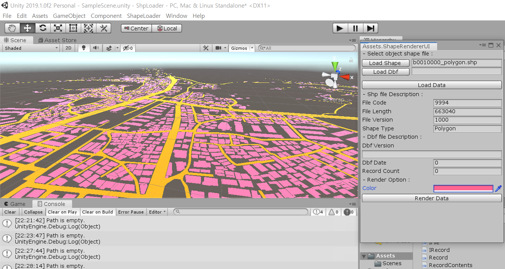

1. shp file read and render
2. dbf file read only

This repo is an experimental written project. There are many bugs due to lack of testing and maintenance. If you want to use it for work, I recommend that you only refer to the written code.

